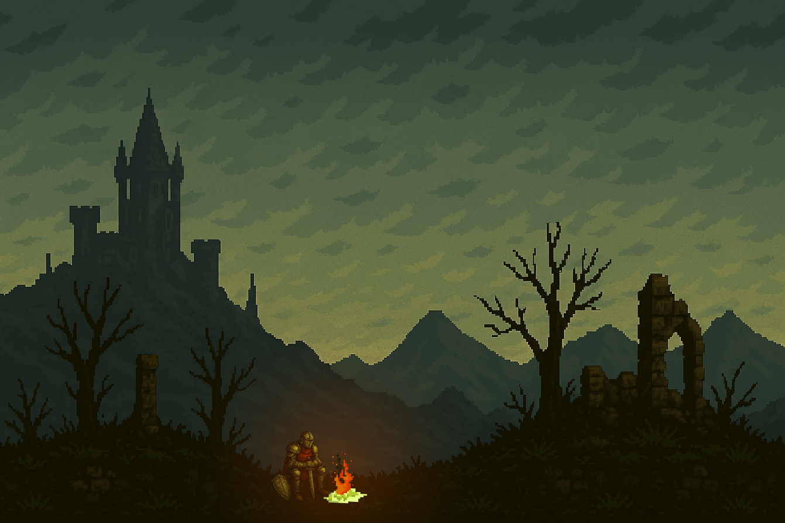

# 🐉 Dragon Souls

Um jogo estilo Flappy Bird feito com Python, OpenGL e GLFW, onde o jogador controla um dragão voador desviando de obstáculos!

## 🎮 Prévia

Neste jogo, você controla um dragão pixelado com gráficos 16-bit, voando entre túneis com dificuldade crescente.

## 🚀 Tecnologias Utilizadas

- Python 3
- GLFW
- PyOpenGL
- PIL (para manipulação de imagens)

## 🧩 Como Executar

### Pré-requisitos

Certifique-se de ter o Python 3 e os pacotes necessários instalados:

    pip install glfw
    pip install PyOpenGL PyOpenGL_accelerate
    pip install pillow
    
## Execução

Dentro do diretório flapyBird, execute:

    python main.py
 ou 

    py main.py

## Problemas na execução

Caso rode o projeto pelo pyCharme deve ser removido na main.py na parte das texturas o "flapyBird/" assim eviitando erro de texturas

exemplo: textura_jogo = carregar_textura("flapyBird/assets/fundoSimples.png")  deve modificar para ficar assim: textura_jogo = carregar_textura("assets/fundoSimples.png")
